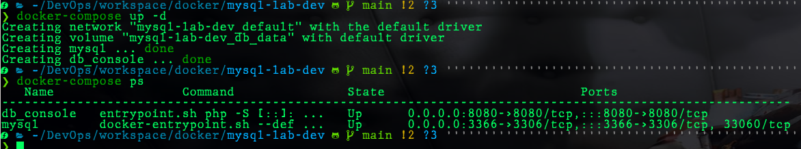

# mysql-lab-dev

## MySQL 5.7 lab container based on Official MySQL Docker.

### **Context**

Mostly we need to create a development environment quickly, and we have to simulate the communication between `database x application` but we don't want to waste time creating/installing our MySQL database locally. Instead of, this project will help you to spin up a persistent DEV database *environment* defining only a few arguments.

___
**Scenario**: This is a useful project for tests and labs which need a database.
In my personal scenario, I am using my [custom MySQL 5.7 Docker Image](https://hub.docker.com/r/alexmbarbosa/mysql5.7):

```yaml
  db:
    image: alexmbarbosa/mysql5.7
```

Meantime, you can use whatever MySQL image if you need. If you prefer it that way, I strongly recommend using the official image:

* https://hub.docker.com/_/mysql

___

### Requirements:

* [docker](https://docs.docker.com/get-docker/)
* [docker-compose](https://docs.docker.com/compose/install/)
* Define database variables:
  
  * MYSQL_ROOT_PASSWORD
  * MYSQL_DATABASE
  * MYSQL_PORT
  * MYSQL_USER
  * MYSQL_PASSWORD
>Tip: Create a **.env** file including variables above. Thus, it is possible to use your environment without exposing passwords.

```yaml
MYSQL_ROOT_PASSWORD='MyStrongPassword'
MYSQL_DATABASE='my-database'
MYSQL_PORT=3306
MYSQL_USER='sysdba'
MYSQL_PASSWORD='UserPassword'
```

### How to use:

After previous steps:

1. Clone this project:
```sh
git clone https://github.com/alexmbarbosa/haproxy-lab-dev.git
```
2. Go to folder haproxy-lab-dev:
```sh
cd mysql-lab-dev
```
3. Execute docker compose:
```sh
docker-compose up -d
```

___
**Author**: Alex Mendes

**LinkedIn**: https://www.linkedin.com/in/mendesalex/
